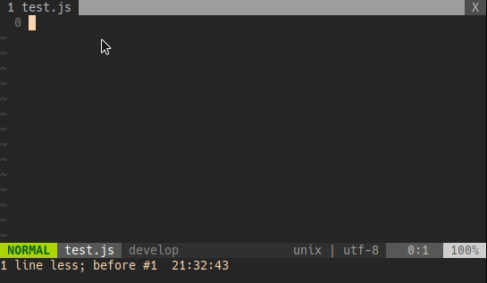

# Output relative file path in Vim

### In a node project, you often want to import another file using a relative path, this small program will construct a relative path for you.



### Pre-requisite
* Fzf
* Ripgrep
* Go (if you want to compile the code)

## Install

1. Compile this code run (or **download** the binary in this repo)
```
go build go-relative-path.go
```

2. Add the binary `go-relative-path`  to system path (or symlink).


3. In your vimrc, add the following Fzf configuration

```
function! s:make_path(path)
  let bPath = expand('%:p:h')
  let fPath = system("realpath " . join(a:path))
  let relPath = system("go-relative-path " . bPath . " " . fPath)
  return substitute(relPath, '\n\+$', '', '')
endfunction

inoremap <expr> <c-x><c-f> fzf#complete(fzf#wrap({
      \ 'source':  'rg --files',
      \ 'reducer': function('<sid>make_path')}))
```

Now, when your're in Vim, `<C-x><C-f>` will trigger a Fzf file search and once you found the file you wanted, hit Enter. This will then output a relative path (from the currenltly opened file) to your selected file.

## NOTE:
Original version of this codes is shared by Fabio here: https://github.com/junegunn/fzf.vim/issues/303#issuecomment-312320316
